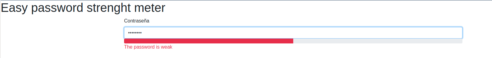
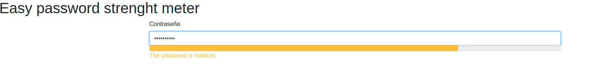
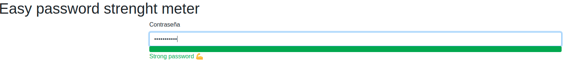

# Easy Password Strenght Meter

Its an easy to use password strenght meter, made from many examples found on the web.

## Usage

You should have imported jQuery and Bootstrap. Then copy the "checkpassword(pwd)" method in a suitable place, and call it in the keyup event of your input password, and that's it!

